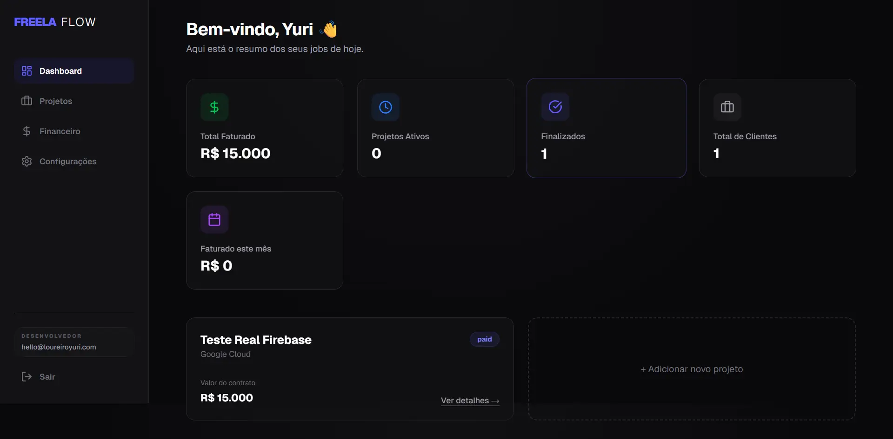
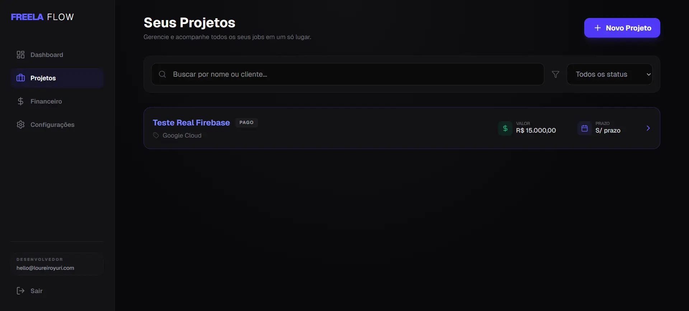
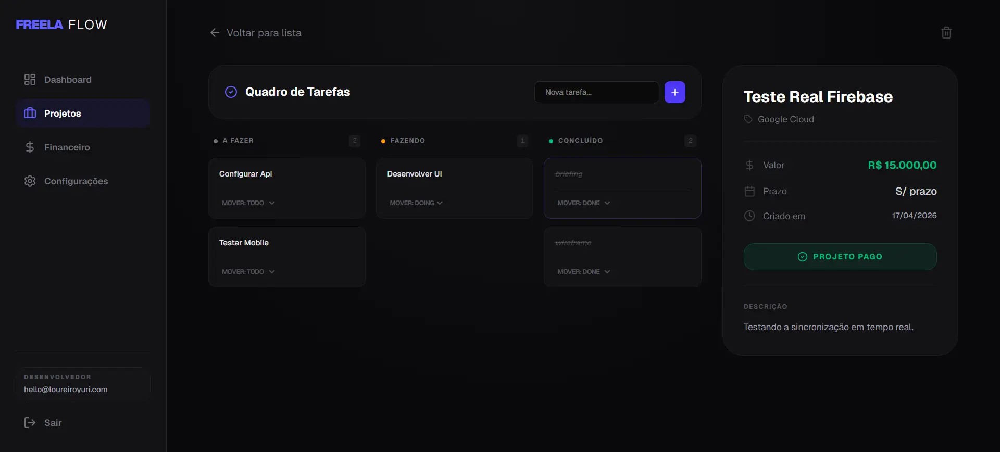
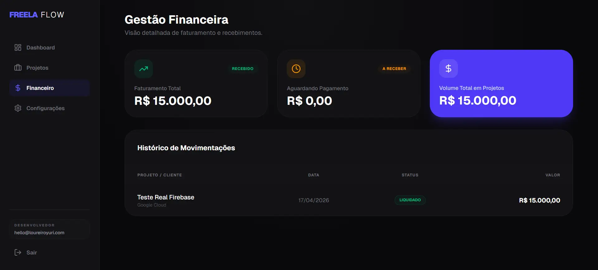
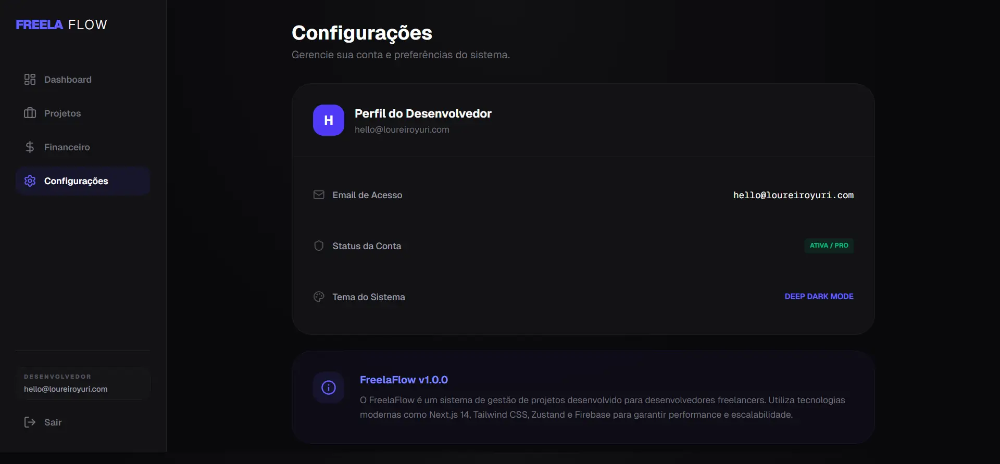

<div align="center">

# 🚀 FreelaFlow

**Modern SaaS dashboard for freelancers — manage projects, tasks and finances in one place.**

[](https://freelaflow-weld.vercel.app)
[]()
[](https://nextjs.org/)
[](https://www.typescriptlang.org/)
[](https://firebase.google.com/)


</div>

---

## 🧠 Product Vision

FreelaFlow was designed to solve a real problem: freelancers often manage projects, tasks and finances across multiple disconnected tools (Notion, Trello, spreadsheets, banking apps...).

This project unifies everything into a **single, elegant and intuitive interface**, focusing on:

- 🎯 Clarity over complexity
- ⚡ Real-time updates with Firestore
- ✨ Smooth user experience
- 🏗️ Clean, scalable architecture

---

## ✨ Features

### 📊 Dashboard Overview

- Total revenue tracking
- Active & completed projects count
- Monthly earnings breakdown
- Recent projects quick access

### 📁 Project Management

- Create and manage client projects
- Track value, deadlines and status (paid / pending)
- Search and filter by status
- Project detail view with full context

### ✅ Kanban Board

- Three-column task organization (To Do / Doing / Done)
- Quick task creation per project
- Smooth transitions and micro-interactions
- Per-project task scope

### 💰 Financial Tracking

- Total revenue vs pending payments
- Volume in active projects
- Transaction history with status
- Visual financial summary cards

### ⚙️ Settings & Auth

- Firebase Authentication (email-based)
- User profile management
- System preferences

### 📱 Responsive Design

- Desktop-first experience with persistent sidebar
- Mobile-friendly bottom navigation (app-like feel)

---

## 🛠️ Tech Stack

| Layer                | Technology                  |
| -------------------- | --------------------------- |
| **Framework**        | Next.js 14 (App Router)     |
| **Language**         | TypeScript                  |
| **Styling**          | Tailwind CSS                |
| **State Management** | Zustand                     |
| **Backend & Auth**   | Firebase (Auth + Firestore) |
| **Animations**       | Framer Motion               |
| **Icons**            | Lucide React                |
| **Deployment**       | Vercel                      |

---

## 🎯 Key Technical Decisions

### Why Next.js App Router?

Enables scalable routing, server components and better separation of UI and logic. Production-ready out of the box.

### Why Zustand over Context API?

Lightweight, scalable, avoids unnecessary re-renders. Better DX for medium-sized state trees than Redux.

### Why Firebase (Serverless)?

Real-time sync across sessions without managing a custom backend. Firestore handles the persistence layer with minimal boilerplate, and Firebase Auth removes session complexity.

### Why Tailwind CSS?

Rapid UI development with a consistent, design-system-friendly utility approach. No runtime CSS-in-JS overhead.

---

## 📸 Screenshots

### Dashboard



### Projects List



### Kanban Board



### Financial Management



### Settings



---

## 🚀 Running Locally

### Prerequisites

- Node.js 20+
- Firebase project with Firestore and Auth enabled

### Installation

```bash
# Clone the repository
git clone https://github.com/yuriiloureiro/freelaflow.git
cd freelaflow

# Install dependencies
npm install

# Create .env.local with your Firebase credentials
cp .env.example .env.local
```
